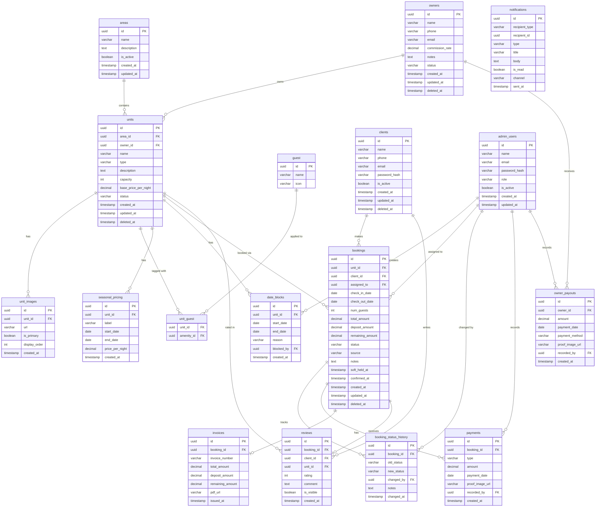

---

## Technical Requirements Document — Full Spec

---

### 1. Final DB Design Decisions

**IDs:** `UUID` في كل جدول — مش auto-increment integer. ليه؟ آمن أكثر (مفيش حد يخمن الـ IDs)، وجاهز للـ distributed systems لو اتوسعنا.

**Soft Deletes:** كل entity مهمة (units, owners, clients, bookings) بيكون فيها `deleted_at TIMESTAMP NULL`. بدل ما نمسح البيانات — بنخبيها. الـ EF Core بيعمل global query filter يتجاهلها تلقائياً.

**Timestamps:** كل جدول بدون استثناء بياخد `created_at` و`updated_at` — EF بيملاهم أوتوماتيك.

**Notifications — Polymorphic:** `recipient_type` enum (`client` / `owner` / `admin`) + `recipient_id` UUID. مفيش FK constraint على الـ DB level — بيتعمل الـ join في الـ application layer. ده الـ best practice للـ polymorphic relations في PostgreSQL.

**Enums في الـ DB:** بنخزنهم كـ `VARCHAR` مش كـ integers — عشان الـ data readable مباشرة في الـ DB بدون جداول lookup.

**Money Fields:** كل الأرقام المالية `DECIMAL(12,2)` — مش `FLOAT`. الـ floating point بيعمل rounding errors في الحسابات المالية.

---

### 2. Migration Order (Dependency-Safe)

```
1.  amenities          (no deps)
2.  areas              (no deps)
3.  admin_users        (no deps)
4.  clients            (no deps)
5.  owners             (no deps)
6.  units              (→ areas, owners)
7.  unit_images        (→ units)
8.  unit_amenities     (→ units, amenities)
9.  seasonal_pricing   (→ units)
10. date_blocks        (→ units, admin_users)
11. bookings           (→ units, clients, admin_users)
12. booking_status_history (→ bookings, admin_users)
13. payments           (→ bookings, admin_users)
14. invoices           (→ bookings)
15. reviews            (→ bookings, clients, units)
16. owner_payouts      (→ owners, admin_users)
17. notifications      (no FK — polymorphic)
```

---

### 3. Project File Structure---

**Solution Root**

**RentalPlatform.sln**

│

**Shared — Enums, Constants, Helpers**

**├── RentalPlatform.Shared/**

│ ├──**Enums/**

│ │ ├──BookingStatus.csprospecting → left_early

│ │ ├──BookingSource.cswebsite, app, whatsapp...

│ │ ├──UnitType.csvilla, chalet, studio

│ │ ├──UnitStatus.cs

│ │ ├──PaymentType.csdeposit, remaining, refund

│ │ ├──AdminRole.cssuper_admin, sales, finance, tech

│ │ ├──NotificationChannel.cs

│ │ ├──RecipientType.cs

│ │ └──DateBlockReason.cs

│ ├──**Constants/**

│ │ ├──BookingStatusTransitions.csvalid state machine rules

│ │ └──RolePermissions.cswhich role can do what

│ └──**Helpers/**

│ ├──DateRangeHelper.csoverlap detection

│ └──InvoiceNumberGenerator.cs

**Data — EF Core, Entities, Repositories**

**├── RentalPlatform.Data/**

│ ├──AppDbContext.cs

│ ├──**Entities/**

│ │ ├──Area.cs

│ │ ├──Owner.cs

│ │ ├──Unit.cs

│ │ ├──UnitImage.cs

│ │ ├──Amenity.cs

│ │ ├──UnitAmenity.cs

│ │ ├──SeasonalPricing.cs

│ │ ├──DateBlock.cs

│ │ ├──Client.cs

│ │ ├──AdminUser.cs

│ │ ├──Booking.cs

│ │ ├──BookingStatusHistory.cs

│ │ ├──Payment.cs

│ │ ├──Invoice.cs

│ │ ├──Review.cs

│ │ ├──OwnerPayout.cs

│ │ └──Notification.cs

│ ├──**Configurations/**— EF Fluent API configs, one per entity

│ ├──**Migrations/**— auto-generated, 17 files

│ ├──**Repositories/**

│ │ ├──IRepository.csgeneric interface

│ │ ├──Repository.csgeneric implementation

│ │ ├──IBookingRepository.csavailability + pipeline queries

│ │ ├──BookingRepository.cs

│ │ ├──IUnitRepository.cssearch + filter queries

│ │ └──UnitRepository.cs

│ └──UnitOfWork.cswraps all repos + SaveChanges

**Business — Services, Validators, Interfaces**

**├── RentalPlatform.Business/**

│ ├──**Interfaces/**

│ │ ├──IAvailabilityService.cs

│ │ ├──IPricingService.cs

│ │ ├──IBookingService.cs

│ │ ├──IFinanceService.cs

│ │ ├──IInvoiceService.cs

│ │ ├──INotificationService.cs

│ │ └──IAuthService.cs

│ ├──**Services/**

│ │ ├──AvailabilityService.cs

│ │ ├──PricingService.cs

│ │ ├──BookingService.cs

│ │ ├──FinanceService.cs

│ │ ├──InvoiceService.cs

│ │ ├──NotificationService.cs

│ │ └──AuthService.cs

│ ├──**BackgroundJobs/**

│ │ ├──AutoCompleteBookingsJob.cs

│ │ └──SendReminderNotificationsJob.cs

│ └──**Validators/**— FluentValidation, one per request DTO

**API — Controllers, DTOs, Middleware**

**└── RentalPlatform.API/**

├──Program.cs

├──appsettings.json

├──**Controllers/**

│ ├──AuthController.cs

│ ├──AreasController.cs

│ ├──UnitsController.cs

│ ├──BookingsController.cs

│ ├──CrmController.cs

│ ├──FinanceController.cs

│ ├──OwnersController.cs

│ ├──ClientsController.cs

│ ├──ReviewsController.cs

│ ├──OwnerPortalController.cs

│ └──AdminUsersController.cs

├──**DTOs/**

│ ├──**Requests/**— what comes IN

│ └──**Responses/**— what goes OUT

└──**Middleware/**

├──ExceptionHandlingMiddleware.cs

└──RoleAuthorizationMiddleware.cs

[Rental platform business requirements and booking workflow - Claude.html](attachment:6eed421f-7e80-4802-8f53-cd2f69027fcc:Rental_platform_business_requirements_and_booking_workflow_-_Claude.html)

### 4. API Endpoints — Complete Map

| Method | Endpoint | Role | Description |
| --- | --- | --- | --- |
| **AUTH** |  |  |  |
| POST | `/api/auth/client/register` | Public | Client signup |
| POST | `/api/auth/client/login` | Public | Client login |
| POST | `/api/auth/admin/login` | Public | Admin login |
| POST | `/api/auth/owner/login` | Public | Owner login |
| POST | `/api/auth/refresh` | Any | Refresh JWT |
| **AREAS** |  |  |  |
| GET | `/api/areas` | Public | List all areas |
| GET | `/api/areas/{id}` | Public | Area details + stats |
| POST | `/api/areas` | SuperAdmin | Create area |
| PUT | `/api/areas/{id}` | SuperAdmin | Update area |
| DELETE | `/api/areas/{id}` | SuperAdmin | Soft delete |
| **UNITS** |  |  |  |
| GET | `/api/units` | Public | Search + filter |
| GET | `/api/units/{id}` | Public | Unit details |
| POST | `/api/units` | Admin | Create unit |
| PUT | `/api/units/{id}` | Admin | Update unit |
| DELETE | `/api/units/{id}` | SuperAdmin | Soft delete |
| GET | `/api/units/{id}/availability` | Public | `?start=&end=` |
| POST | `/api/units/{id}/block-dates` | Admin | Block maintenance/owner dates |
| DELETE | `/api/units/{id}/block-dates/{blockId}` | Admin | Remove block |
| POST | `/api/units/{id}/images` | Admin | Upload images |
| DELETE | `/api/units/{id}/images/{imageId}` | Admin | Remove image |
| **BOOKINGS / CRM** |  |  |  |
| POST | `/api/bookings` | Client | Create booking → Prospecting |
| GET | `/api/bookings` | Admin/Sales | List + filter by status/unit/date |
| GET | `/api/bookings/{id}` | Admin/Sales | Full booking + history |
| PATCH | `/api/bookings/{id}/status` | Admin/Sales | Transition status |
| PATCH | `/api/bookings/{id}/notes` | Admin/Sales | Update CRM notes |
| PATCH | `/api/bookings/{id}/assign` | SuperAdmin | Assign to Sales user |
| POST | `/api/bookings/{id}/payments` | Admin/Sales | Record deposit or remaining |
| GET | `/api/bookings/{id}/invoice` | Admin/Client | Download invoice |
| GET | `/api/crm/pipeline` | Admin/Sales | Grouped by status |
| **FINANCE** |  |  |  |
| GET | `/api/finance/overview` | Finance/Admin | Revenue totals |
| GET | `/api/finance/transactions` | Finance/Admin | Full transaction log |
| GET | `/api/finance/owner-payouts` | Finance/Admin | All payouts |
| POST | `/api/finance/owner-payouts` | Finance/Admin | Record payout |
| GET | `/api/finance/owner-payouts/{id}` | Finance/Admin | Payout detail |
| **OWNERS** |  |  |  |
| GET | `/api/owners` | Admin | List owners |
| POST | `/api/owners` | SuperAdmin | Create owner |
| GET | `/api/owners/{id}` | Admin | Full profile |
| PUT | `/api/owners/{id}` | SuperAdmin | Update |
| PATCH | `/api/owners/{id}/status` | SuperAdmin | Activate/deactivate |
| GET | `/api/owners/{id}/payouts` | Finance/Admin | Payout history |
| GET | `/api/owners/{id}/earnings` | Finance/Admin | Earnings breakdown |
| **CLIENTS** |  |  |  |
| GET | `/api/clients` | Admin/Sales | List clients |
| GET | `/api/clients/{id}` | Admin/Sales | Full profile + history |
| GET | `/api/clients/{id}/bookings` | Admin/Sales | Booking history |
| **REVIEWS** |  |  |  |
| POST | `/api/reviews` | Client | Submit review (post-completed) |
| GET | `/api/units/{id}/reviews` | Public | Unit reviews |
| PATCH | `/api/reviews/{id}/visibility` | Admin | Show/hide review |
| **OWNER PORTAL** |  |  |  |
| GET | `/api/owner-portal/units` | Owner | Own units only |
| GET | `/api/owner-portal/units/{id}/availability` | Owner | Own unit calendar |
| GET | `/api/owner-portal/earnings` | Owner | Earnings summary |
| GET | `/api/owner-portal/payouts` | Owner | Payout history |
| GET | `/api/owner-portal/notifications` | Owner | Portal notifications |
| **ADMIN USERS** |  |  |  |
| GET | `/api/admin-users` | SuperAdmin | List admin team |
| POST | `/api/admin-users` | SuperAdmin | Create admin user |
| PATCH | `/api/admin-users/{id}/role` | SuperAdmin | Change role |
| PATCH | `/api/admin-users/{id}/status` | SuperAdmin | Activate/deactivate |
| **AMENITIES** |  |  |  |
| GET | `/api/amenities` | Public | All amenities list |
| POST | `/api/amenities` | SuperAdmin | Add amenity |

---

### 5. Authentication & Security

**JWT Strategy:**

```
Access Token  → 15 minutes expiry
Refresh Token → 7 days expiry, stored in HttpOnly cookie
3 separate token types: client_token / admin_token / owner_token
Each carries: userId, role (for admin), tokenType
```

**Password Hashing:** BCrypt با work factor 12

**Authorization Matrix:**

| Resource | SuperAdmin | Sales | Finance | Tech | Owner | Client |
| --- | --- | --- | --- | --- | --- | --- |
| CRM Pipeline | ✓ | ✓ | — | — | — | — |
| Finance Tab | ✓ | — | ✓ | — | — | — |
| Unit Management | ✓ | View | View | ✓ | Own only | Public |
| Owner Profiles | ✓ | View | View | — | Own only | — |
| Client Profiles | ✓ | ✓ | — | — | — | — |
| Admin Users | ✓ | — | — | — | — | — |
| Owner Payouts | ✓ | — | ✓ | — | — | — |

**File Upload Security:**

- Allowed types: `jpg, jpeg, png, webp, pdf`
- Max size: 10MB per file
- بيتخزن على Cloud Storage (Azure Blob / AWS S3) — مش على الـ server
- اسم الـ file بيتولد كـ UUID في الـ backend — مش بناخد اسم الـ file من الـ user

**Rate Limiting:**

- Auth endpoints: 10 requests / minute / IP
- Public search: 60 requests / minute / IP

**CORS:** Whitelist بس — Next.js domain + Flutter يستخدم token مباشرة (no CORS needed)

---

### 6. Business Logic Rules — Service Responsibilities

**AvailabilityService:**

```
IsAvailable(unitId, checkIn, checkOut):
  → Query bookings WHERE unit_id = X
    AND status IN (booked, confirmed, check_in)
    AND dates overlap
  → Query date_blocks WHERE unit_id = X AND dates overlap
  → Return false if any result found

SoftHold(unitId, checkIn, checkOut, bookingId):
  → Called immediately when booking created
  → Status = 'booked', soft_held_at = NOW()
  → Dates locked for this bookingId only

ReleaseHold(bookingId):
  → Called when status → not_relevant OR cancelled (before confirmed)
  → Dates become available again
```

**PricingService:**

```
CalculateTotal(unitId, checkIn, checkOut):
  → numNights = checkOut - checkIn (in days)
  → For each night: check if SeasonalPricing covers that date
    → If yes: use seasonal price_per_night
    → If no: use unit.base_price_per_night
  → total = SUM of all nightly prices
```

**BookingService — Status Transition Rules:**

```
Valid transitions only:
  prospecting  → relevant, no_answer, not_relevant
  relevant     → booked, no_answer, not_relevant
  no_answer    → relevant, not_relevant
  booked       → confirmed, not_relevant (releases hold)
  confirmed    → check_in, cancelled (no refund — logged)
  check_in     → completed, left_early

On every transition:
  1. Validate transition is allowed
  2. Update booking.status
  3. Insert row in booking_status_history
  4. Trigger relevant side effects (see below)

Side effects by transition:
  → confirmed:  GenerateInvoice() + SendConfirmationEmail()
  → check_in:   RecordRemainingPayment() trigger
  → completed:  TriggerReviewRequest() after 24h
  → cancelled:  ReleaseAvailability() + LogCancellation()
  → left_early: ReleaseAvailability() + LogEarlyLeave()
```

**InvoiceService:**

```
GenerateInvoice(bookingId):
  → invoice_number = INV-{YEAR}{MONTH}-{5-digit-sequence}
  → Snapshot: unit name, dates, total, deposit, remaining, client name
  → Store as PDF on cloud storage
  → Save Invoice record in DB
  → Send email with PDF attachment to client
```

---

### 7. Background Jobs

**Runner:** .NET `IHostedService` مع `PeriodicTimer` — بسيط، مش محتاجين Hangfire في الـ MVP.

```
AutoCompleteBookingsJob       → runs daily at 02:00 AM
  → Find bookings WHERE status = 'check_in'
    AND check_out_date < TODAY
  → Transition each to 'completed'
  → Log in booking_status_history (changed_by = SYSTEM)
  → Queue review request notification

SendCheckInRemindersJob       → runs daily at 09:00 AM
  → Find bookings WHERE status = 'confirmed'
    AND check_in_date = TOMORROW
  → Send email + SMS to client

SendCheckOutRemindersJob      → runs daily at 08:00 AM
  → Find bookings WHERE status = 'check_in'
    AND check_out_date = TODAY
  → Send in-app reminder to admin

SendReviewRequestsJob         → runs daily at 10:00 AM
  → Find bookings WHERE status = 'completed'
    AND completed_at < NOW - 24h
    AND no review exists
  → Send review request email to client
```

---

### 8. Database Indexing Strategy

```sql
-- Availability (most critical — runs on every search)
CREATE INDEX idx_bookings_availability
  ON bookings(unit_id, check_in_date, check_out_date)
  WHERE status IN ('booked','confirmed','check_in')
  AND deleted_at IS NULL;

CREATE INDEX idx_date_blocks_unit_dates
  ON date_blocks(unit_id, start_date, end_date);

CREATE INDEX idx_seasonal_pricing_unit_dates
  ON seasonal_pricing(unit_id, start_date, end_date);

-- CRM Pipeline
CREATE INDEX idx_bookings_status       ON bookings(status);
CREATE INDEX idx_bookings_assigned_to  ON bookings(assigned_to);
CREATE INDEX idx_bookings_client       ON bookings(client_id);

-- Finance
CREATE INDEX idx_payments_booking      ON payments(booking_id);
CREATE INDEX idx_owner_payouts_owner   ON owner_payouts(owner_id);
CREATE INDEX idx_bookings_confirmed_at ON bookings(confirmed_at);

-- Notifications
CREATE INDEX idx_notifications_recipient
  ON notifications(recipient_type, recipient_id, is_read);

-- Unit Search (public)
CREATE INDEX idx_units_area_status ON units(area_id, status)
  WHERE deleted_at IS NULL;
```

---

### 9. Key Technical Constraints

```
Booking:
  check_out_date > check_in_date           (DB constraint)
  num_guests > 0                           (DB constraint)
  num_guests <= unit.capacity              (Business layer)
  deposit_amount <= total_amount           (Business layer)
  remaining_amount = total - deposit       (Computed, not stored separately)

Unit:
  base_price_per_night > 0                (DB constraint)
  capacity > 0                            (DB constraint)

SeasonalPricing:
  end_date > start_date                   (DB constraint)
  No overlapping date ranges per unit     (Business layer check)

Review:
  rating BETWEEN 1 AND 5                  (DB constraint)
  booking.status = 'completed'            (Business layer — can't review unfinished stay)
  One review per booking                  (Unique constraint: booking_id)

Payment:
  amount > 0                              (DB constraint)
  type = 'deposit' → booking.status must be 'confirmed'
  type = 'remaining' → booking.status must be 'check_in'
```

---

### 10. Response Format Standard

كل الـ API responses بتيجي بنفس الـ format:

```json
{
  "success": true,
  "data": { ... },
  "message": null,
  "errors": null,
  "pagination": {
    "page": 1,
    "pageSize": 20,
    "total": 143
  }
}
```

Error response:

```json
{
  "success": false,
  "data": null,
  "message": "Cannot confirm booking — no deposit recorded",
  "errors": ["deposit_amount is required"],
  "pagination": null
}
```

---

## ✅ Technical Requirements — 100% Frozen

```
✓ DB: PostgreSQL + UUID + Soft Deletes + DECIMAL for money
✓ ORM: Entity Framework Core (Code First)
✓ Business Layer: C# Services + Repository Pattern + Unit of Work
✓ API: RESTful .NET — 11 controllers, 50+ endpoints
✓ Auth: JWT (15min access + 7d refresh) — 3 separate flows
✓ Security: BCrypt + Rate Limiting + CORS + Cloud file storage
✓ File Structure: 4-project solution, clean separation
✓ Migration Order: 17 migrations, dependency-safe
✓ Indexes: 10 targeted indexes for critical queries
✓ Background Jobs: 4 jobs via IHostedService
✓ Status Machine: enforced in BookingService with side effects
✓ Pricing: nightly seasonal override logic
✓ Availability: computed — no separate table
✓ Notifications: polymorphic recipient model
✓ Response Format: unified success/error envelope
✓ Constraints: DB-level + Business-layer double enforcement
```

---



ناقص حاجات بسيطة نضيفها للـ technical requirements. إليك كل اللي محتاجه:

---

### Docker — Files Needed

```
RentalPlatform/
├── docker-compose.yml          ← local dev (API + DB + pgAdmin)
├── docker-compose.prod.yml     ← production override
├── .env.example                ← template للـ environment variables
├── RentalPlatform.API/
│   └── Dockerfile              ← multi-stage build
└── .dockerignore
```

---

### `Dockerfile` — Multi-Stage Build

```docker
FROM mcr.microsoft.com/dotnet/sdk:8.0 AS build
WORKDIR /src

COPY RentalPlatform.sln .
COPY RentalPlatform.Shared/RentalPlatform.Shared.csproj       RentalPlatform.Shared/
COPY RentalPlatform.Data/RentalPlatform.Data.csproj           RentalPlatform.Data/
COPY RentalPlatform.Business/RentalPlatform.Business.csproj   RentalPlatform.Business/
COPY RentalPlatform.API/RentalPlatform.API.csproj             RentalPlatform.API/

RUN dotnet restore

COPY . .
RUN dotnet publish RentalPlatform.API/RentalPlatform.API.csproj \
    -c Release -o /app/publish --no-restore

FROM mcr.microsoft.com/dotnet/aspnet:8.0 AS runtime
WORKDIR /app

COPY --from=build /app/publish .

EXPOSE 8080
ENTRYPOINT ["dotnet", "RentalPlatform.API.dll"]
```

---

### `docker-compose.yml` — Local Dev

```yaml
services:

  api:
    build:
      context: .
      dockerfile: RentalPlatform.API/Dockerfile
    container_name: rental_api
    ports:
      - "8080:8080"
    environment:
      - ASPNETCORE_ENVIRONMENT=Development
      - ConnectionStrings__Default=Host=db;Port=5432;Database=rental_db;Username=postgres;Password=${DB_PASSWORD}
      - Jwt__Secret=${JWT_SECRET}
      - Jwt__AccessTokenExpiry=15
      - Jwt__RefreshTokenExpiry=10080
      - Storage__ConnectionString=${STORAGE_CONNECTION}
      - Storage__ContainerName=${STORAGE_CONTAINER}
      - Email__SmtpHost=${SMTP_HOST}
      - Email__SmtpPort=${SMTP_PORT}
      - Email__From=${EMAIL_FROM}
      - Email__Password=${EMAIL_PASSWORD}
    depends_on:
      db:
        condition: service_healthy
    networks:
      - rental_network
    restart: unless-stopped

  db:
    image: postgres:16-alpine
    container_name: rental_db
    ports:
      - "5432:5432"
    environment:
      POSTGRES_DB: rental_db
      POSTGRES_USER: postgres
      POSTGRES_PASSWORD: ${DB_PASSWORD}
    volumes:
      - postgres_data:/var/lib/postgresql/data
    healthcheck:
      test: ["CMD-SHELL", "pg_isready -U postgres"]
      interval: 10s
      timeout: 5s
      retries: 5
    networks:
      - rental_network
    restart: unless-stopped

  pgadmin:
    image: dpage/pgadmin4:latest
    container_name: rental_pgadmin
    ports:
      - "5050:80"
    environment:
      PGADMIN_DEFAULT_EMAIL: admin@rental.com
      PGADMIN_DEFAULT_PASSWORD: ${PGADMIN_PASSWORD}
    depends_on:
      - db
    networks:
      - rental_network
    restart: unless-stopped

volumes:
  postgres_data:

networks:
  rental_network:
    driver: bridge
```

---

### `docker-compose.prod.yml` — Production Override

```yaml
services:

  api:
    build:
      context: .
      dockerfile: RentalPlatform.API/Dockerfile
    environment:
      - ASPNETCORE_ENVIRONMENT=Production
    restart: always
    deploy:
      resources:
        limits:
          memory: 512m

  db:
    restart: always
    deploy:
      resources:
        limits:
          memory: 1g

# pgadmin مش بيتشغل في production
```

تشغيل production:

```bash
docker compose -f docker-compose.yml -f docker-compose.prod.yml up -d
```

---

### `.env.example`

```
# Database
DB_PASSWORD=your_strong_password_here

# JWT
JWT_SECRET=your_256_bit_secret_key_here

# Cloud Storage (Azure Blob / AWS S3)
STORAGE_CONNECTION=your_storage_connection_string
STORAGE_CONTAINER=rental-uploads

# Email (SMTP)
SMTP_HOST=smtp.gmail.com
SMTP_PORT=587
EMAIL_FROM=noreply@yourplatform.com
EMAIL_PASSWORD=your_email_password

# pgAdmin (dev only)
PGADMIN_PASSWORD=admin123
```

---

### `.dockerignore`

```
**/bin/
**/obj/
**/.vs/
**/.git/
**/node_modules/
**/*.user
.env
docker-compose.prod.yml
README.md
```

---

### أوامر يومية

```bash
# تشغيل كل حاجة
docker compose up -d

# مشوف الـ logs
docker compose logs -f api

# تشغيل الـ migrations
docker compose exec api dotnet ef database update

# إعادة build بعد code changes
docker compose up -d --build api

# إيقاف كل حاجة
docker compose down

# إيقاف + مسح الـ DB (fresh start)
docker compose down -v
```

---

### Updated Tech Stack — Final

```
Database        PostgreSQL 16 (Docker)
ORM             Entity Framework Core 8
Backend         .NET 8 — C#
API             RESTful API
Frontend Web    Next.js
Mobile          Flutter
Containerization Docker + Docker Compose
Storage         Azure Blob / AWS S3
```

---